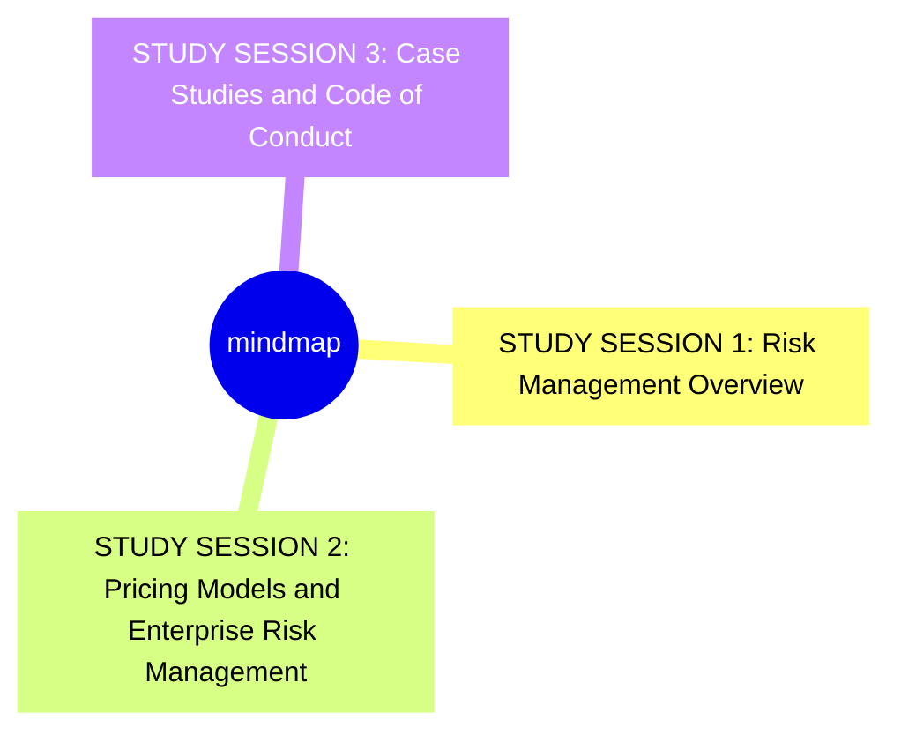
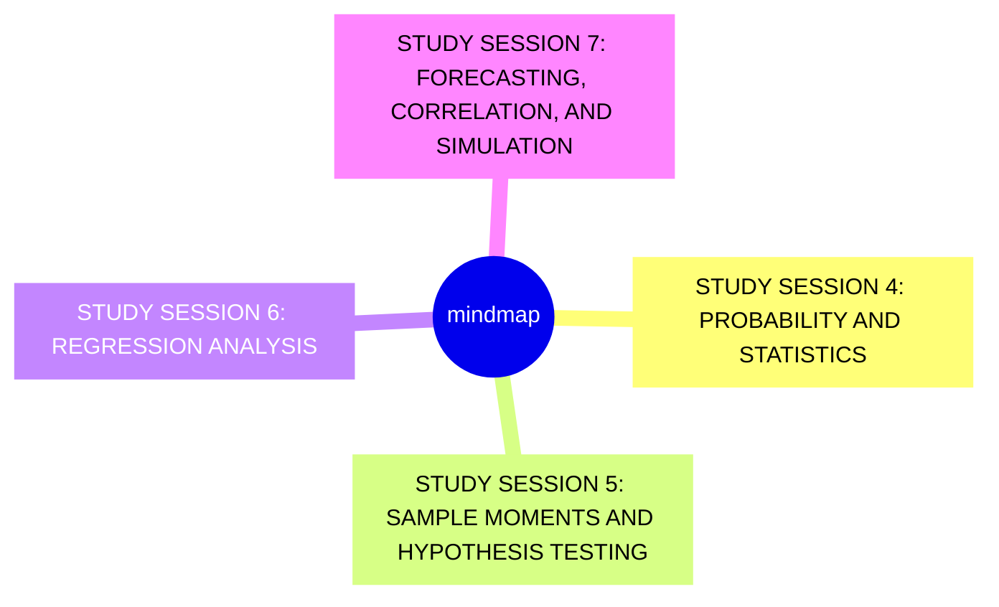
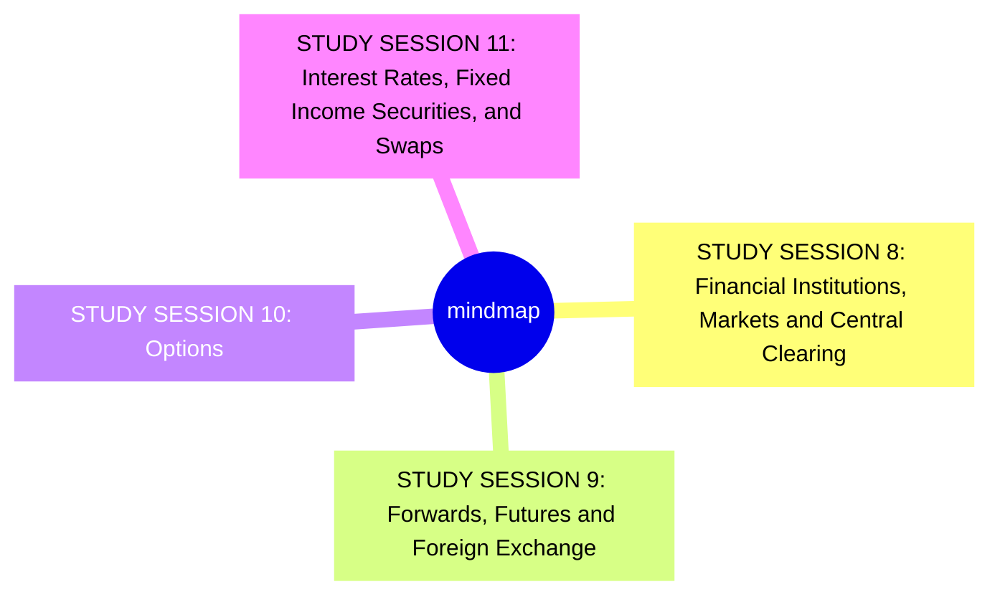
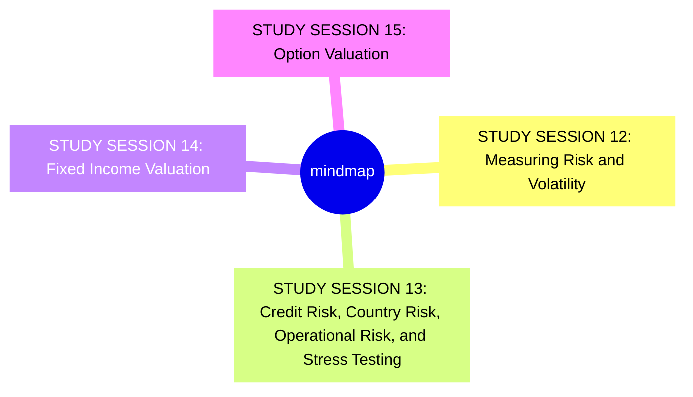

FRM
===

# FRM I

## Book 1: Foundations of Risk Management

```mermaid
mindmap
  root((mindmap))
    id_r1["`STUDY SESSION 1: Risk Management Overview`"]
    id_r2["`STUDY SESSION 2: Pricing Models and Enterprise Risk Management`"]
    id_r3["`STUDY SESSION 3: Case Studies and Code of Conduct`"]
```

## Book 2: Quantitative Analysis

```mermaid
mindmap
  root((mindmap))
    id_r4["`STUDY SESSION 4: PROBABILITY AND STATISTICS`"]
    id_r5["`STUDY SESSION 5: SAMPLE MOMENTS AND HYPOTHESIS TESTING`"]
    id_r6["`STUDY SESSION 6: REGRESSION ANALYSIS`"]
    id_r7["`STUDY SESSION 7: FORECASTING, CORRELATION, AND SIMULATION`"]
```

## Book 3: Financial Markets and Products

```mermaid
mindmap
  root((mindmap))
    id_r8["`STUDY SESSION 8: Financial Institutions, Markets and Central Clearing`"]
    id_r9["`STUDY SESSION 9: Forwards, Futures and Foreign Exchange`"]
    id_r10["`STUDY SESSION 10: Options`"]
    id_r11["`STUDY SESSION 11: Interest Rates, Fixed Income Securities, and Swaps`"]
```    
    
## Book 4: Valuation and Risk Models

```mermaid
mindmap
  root((mindmap))
    id_r12["`STUDY SESSION 12: Measuring Risk and Volatility`"]
    id_r13["`STUDY SESSION 13: Credit Risk, Country Risk, Operational Risk, and Stress Testing`"]
    id_r14["`STUDY SESSION 14: Fixed Income Valuation`"]
    id_r15["`STUDY SESSION 15: Option Valuation`"]

```