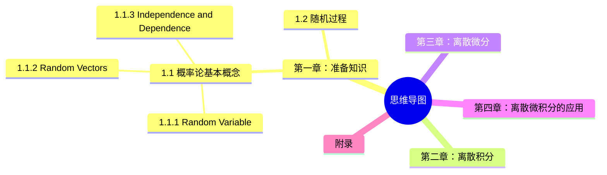

# Elementary Stochastic Calculus with Finance in View

***

| Node  | Term                | Note                                                       |
|-------|---------------------|------------------------------------------------------------|
| 1.1.1 | ω                   | outcomes                                                   |
| 1.1.1 | Ω                   | outcome space                                              |
| 1.1.1 | Event               | the subsets of Ω, e.g., {ω: X(ω) ∈ B}                      |
| 1.1.1 | 𝑭                  | σ-field / σ-algebra                                        |
| 1.1.1 | X = X(ω)            | random variable X                                          |
| 1.1.1 | Borel sets          | subsets B of R                                             |
| 1.1.2 | random structures   | finite-dimensional and infinite dimensional random vectors |
| 1.1.2 | marginal densities  |                                                            |

***

[下载链接](https://pan.baidu.com/s/17U9lB)
