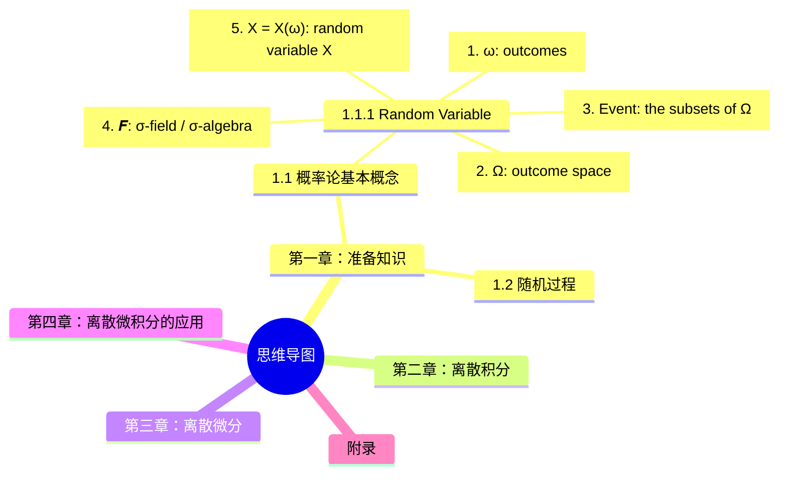

# Elementary Stochastic Calculus with Finance in View

***

```mermaid
mindmap
  root((思维导图))
    第一章：准备知识 
      1.1 概率论基本概念
        1.1.1 Random Variable
            id1111["`1. ω: outcomes`"]
            id1112["`2. Ω: outcome space`"]
            id1113["`3. Event: the subsets of Ω`"]
            id1114["`4. 𝑭: σ-field / σ-algebra`"]
            id1115["`5. X = X(ω): random variable X`"]
      1.2 随机过程
    第二章：离散积分
    第三章：离散微分
    第四章：离散微积分的应用
    附录
 
```

***

[下载链接](https://pan.baidu.com/s/17U9lB)
