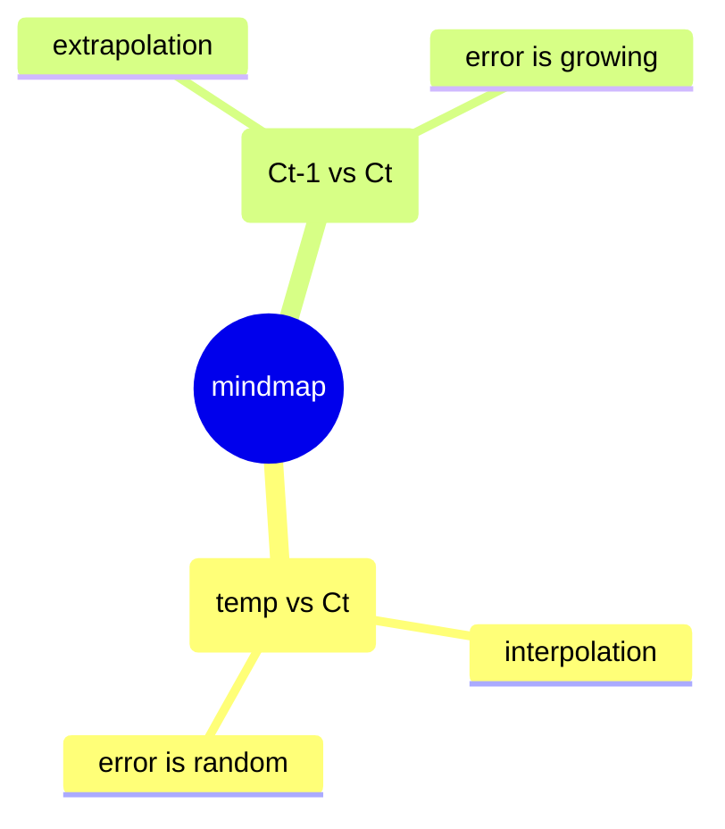

Time Series Analysis
===

## [Why Are Time Series Special](https://www.youtube.com/watch?v=ZoJ2OctrFLA&list=PLvcbYUQ5t0UHOLnBzl46_Q6QKtFgfMGc3&index=1)

## [Basics of PCA (Principal Component Analysis) : Data Science Concepts](https://youtu.be/pmG4K79DUoI?si=3XdV9ZG7wIHCw2RO)

Targets:
1. dimension reduction: remove some independent while minor dimension
2. visualization: 3 dimensions are the maximum that we could draw on the diagram
3. feature extraction: remove som non-independent dimensions without losing dynamics

## [Principal Component Analysis (The Math) : Data Science Concepts](https://youtu.be/dhK8nbtii6I?si=oKNQFi163lRcNv0W)
Foundations:

1. vector projection
2. eigenvalues and eigenvectors
3. LaGrant multipliers
4. derivatives of a matrix
5. covariance matrix