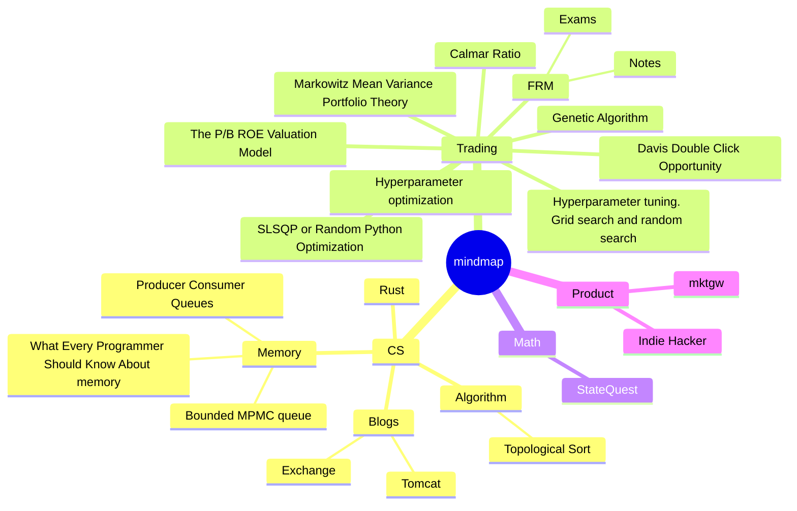

2023 Workmap
====

```mermaid
mindmap
  root((mindmap))
    CS
      Rust
      Blogs
        Exchange
        Tomcat
      Memory  
        What Every Programmer Should Know About memory
        Bounded MPMC queue
        Producer Consumer Queues
      Algorithm
        Topological Sort
    Trading
      FRM
        Notes
        Exams
      Genetic Algorithm
      Hyperparameter optimization
      Hyperparameter tuning. Grid search and random search
      The P/B ROE Valuation Model
      Davis Double Click Opportunity
      Calmar Ratio
      SLSQP or Random Python Optimization 
      Markowitz Mean Variance Portfolio Theory
    Math
      StateQuest
    Product
      Indie Hacker
      mktgw
```