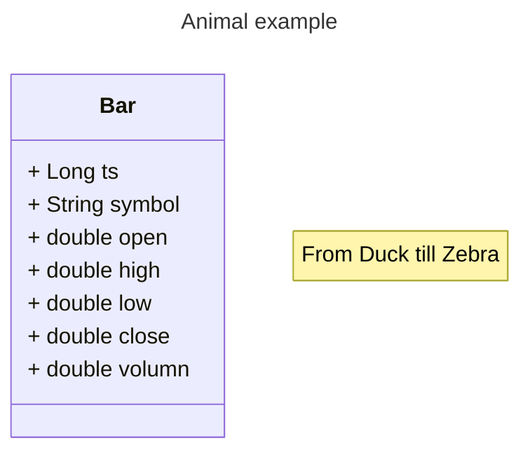

FRD: Fama-French 3 Factor Model
====

# Functional Requirements

## Stock Selection

## Portfolio Construction

1. MPT
2. Kelly's Formula

## Risk Management

## Hedging Advices

# Non-functional Requirements

## Backtest

# Stories

## Epic 1: Fama-French 3-Factor Model on a Basket of Stocks

### E1S1: Create a Basket of Selected Stocks

1. Input: tickers

### E1S2: Prepare the Market Data

1. OHLCV of the tickers
2. Rf
3. Input: duration to look back

### E1S3: Calculate the SMB of the Basket

### E1S4: Calculate the HML of the Basket

### E1S5: Calculate the Return of the Basket

### E1S6: Sort the Stocks based on Alpha

### E1S7: Options of the Combination

### E1S8: GRS test

# Reference

1. [多因子选股(股票)](https://www.myquant.cn/docs/python_strategyies/103)
2. [Fama-French三因子模型最深剖析](https://www.bilibili.com/video/BV11Y411x7jy/?spm_id_from=333.999.0.0&vd_source=3caf1cf2eb94db028e6f5b496be93bc8)