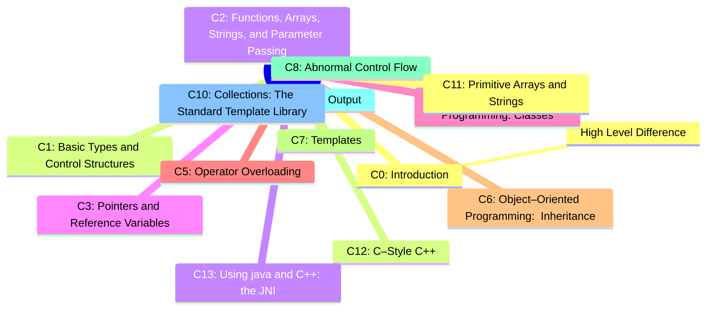

# C++ for Java Programmers

## Text Book

***

***

[READ ONLINE](https://changkun.de/modern-cpp/en-us/00-preface/)

***

## Practice

[Build Your Own Redis with C/C++](https://build-your-own.org/redis/)

[dyredis](https://github.com/damonYuan/dyredis)

***

[Let's Build a Simple Database](https://cstack.github.io/db_tutorial/)

***

[Learn C++ online](https://www.learncpp.com/)

*** 

## Blogs

### Build System

- [Understanding C/C++ Build system by building a simple project](https://dev.to/narasimha1997/understanding-c-c-build-system-by-building-a-simple-project-part-1-4fff) and here is the [code](https://github.com/damonYuan/memlogger) updated for Mac OS.
- [The Complete C++ Build System: CMake & Ninja](https://medium.com/@codeinseoul/the-complete-c-build-system-cmake-ninja-part-1-b7309be1a11e)
