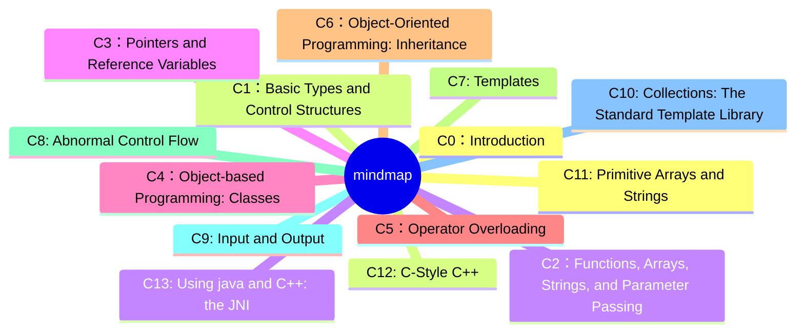

# C++ for Java Programmers

## Text Book

***

```mermaid
mindmap
  root((mindmap))
    C0：Introduction
    C1：Basic Types and Control Structures
    C2：Functions, Arrays, Strings, and Parameter Passing
    C3：Pointers and Reference Variables
    C4：Object-based Programming: Classes
    C5：Operator Overloading
    C6：Object-Oriented Programming: Inheritance
    C7: Templates
    C8: Abnormal Control Flow
    C9: Input and Output
    C10: Collections: The Standard Template Library
    C11: Primitive Arrays and Strings
    C12: C-Style C++
    C13: Using java and C++: the JNI
 
```

***

## Practice

[Build Your Own Redis with C/C++](https://build-your-own.org/redis/)

