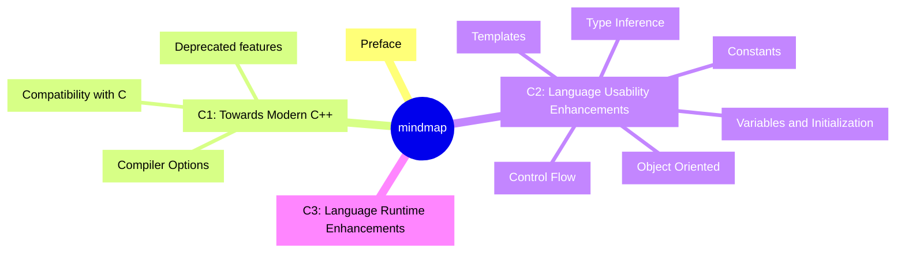

# C++ for Java Programmers

## Text Book

***

***

[READ ONLINE](https://changkun.de/modern-cpp/en-us/00-preface/)

| Node | Note                                      |
|------|-------------------------------------------|
| id10 | clang++ and -std=c++2a                    |
| id13 | external keyword for compatibility with C |

***

## Practice

[Build Your Own Redis with C/C++](https://build-your-own.org/redis/)

