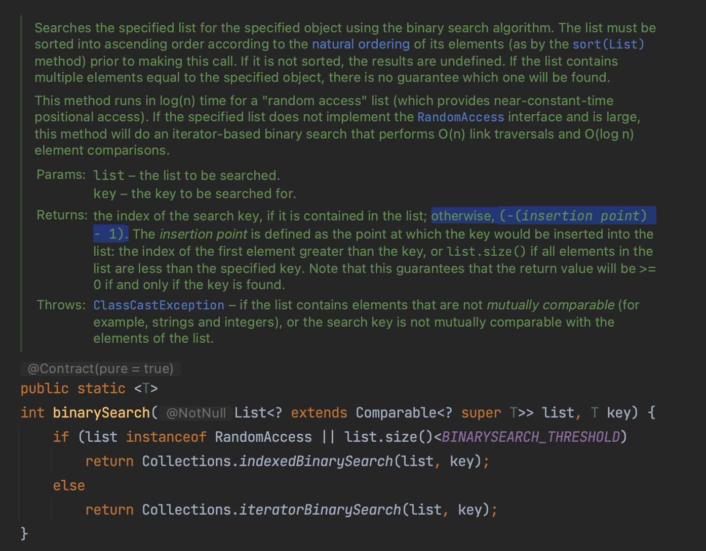

# Interesting Bitwise Operation

## `-(n+1) = ~n`

If you ever stare at the document of `import static java.util.Collections.binarySearch;`, you will find an interesting description about the return value when element not found in the list,



Here comes up a simple question - how to get the insert point `n` if `-n-1` is returned? The straight-forward way is to do the simple math `(returned + 1) * -1`, while a more interesting way is using bitwise complement `~n`. The bitwise complement returns the one’s complement representation of the input value.

We know the overflow property of the computer's complement: when an unsigned number overflows upward, it becomes 0. when `n + ~n`, all the bits in the result equals to 1, and taking the overflow property into account, `n + ~n + 1 = 0`, which equals to `~n = -(n+1)`. Using this property we can find the insertion point faster and smarter.

Reference in js: [Double bitwise NOT (~~)](https://j11y.io/cool-stuff/double-bitwise-not/)

## Round a Positive Number Up to its Nearest Quadratic Power

The following snippet of code could round a positive number up to its nearest quadratic power,

``` java
public static long findPowerOfTwo(long givenNum) {
    givenNum--;                 // L1
    givenNum |= givenNum >> 1;  // L2
    givenNum |= givenNum >> 2;  // L3 
    givenNum |= givenNum >> 4;  // L4
    givenNum |= givenNum >> 8;  // L5
    givenNum |= givenNum >> 16; // L6
    givenNum |= givenNum >> 32; // L7
    givenNum++;                 // L8
    
    return givenNum;
}
```
Let's go through the code, given `42 = 00101010`

1. L1: Decrement the givenMum value by 1. This is done to ensure that if the given number is already a power of two, it will be returned as is. `41 = 00101001`
2. L2: As the highest bit for the result of L1 is always 1, the L2 will set the 1st and 2nd bits (left to right) of the givenNum to 1. Now the first 2 bits are 1. `41 |= 41 >> 1  =>  00101001 |= 00010100  =>  00111101`
3. L3: `41 |= 41 >> 2  =>  00111101 |= 00001111  =>  00111111`
4. L4: `41 |= 41 >> 4  =>  00111111 |= 00000011  =>  00111111`
5. L5: `41 |= 41 >> 8  =>  00111111 |= 00000000  =>  00111111`
6. L6: `41 |= 41 >> 16 =>  00111111 |= 00000000  =>  00111111`
7. L7: `41 |= 41 >> 32 =>  00111111 |= 00000000  =>  00111111`
8. L8: `42 = 00111111 + 1  =>  01000000`, The resulting number, 64, is the nearest power of two that is less than or equal to the given number 42.

So what's the usage of this function? RingBuffer.

A RingBuffer has a head and a tail pointer to identify the reading and writing point. Whenever the value of head / tail reaches capacity, we need to reset it to 0. head / tail++ and determine and reset to 0 are two operations, and they can't be synchronized in a lock-free state. Of course, we can calculate the new value first and update it with CAS, but the more we do it, the higher the probability of error, and we expect a simpler way to realize "turn around".

We know the overflow property of the computer's complement: when an unsigned number overflows upwards, it becomes 0. We can use this property to limit tail/head, but the problem with using it directly is that the capacity can only be 2^8/16/32/64.

## mod

n mod m = n & (m-1), 600 times faster than mod operation.
