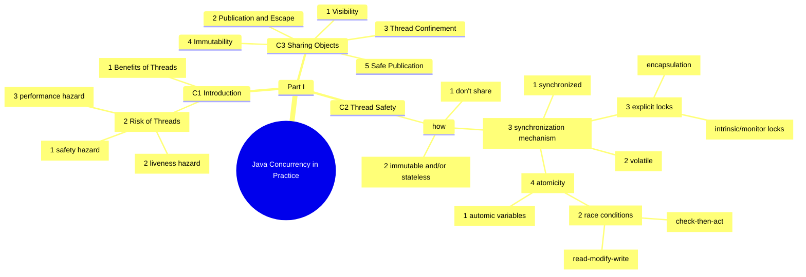

Java Concurrency in Practice
====

```mermaid
mindmap
  root((Java Concurrency in Practice))
    Part I
      C1 Introduction
        id[1 Benefits of Threads]
        id[2 Risk of Threads]
           id[1 safety hazard]
           id[2 liveness hazard]
           id[3 performance hazard]
      C2 Thread Safety
        how
          id[1 don't share]
          id[2 immutable and/or stateless]
          id[3 synchronization mechanism]
            id[1 synchronized]
            id[2 volatile]
            id[3 explicit locks]
              id[intrinsic/monitor locks]
              id[encapsulation]
            id[4 atomicity]
              id[1 automic variables]
              id[2 race conditions]
                id[check-then-act]
                id[read-modify-write]
      C3 Sharing Objects
        1 Visibility
        2 Publication and Escape
        3 Thread Confinement
        4 Immutability
        5 Safe Publication
```
