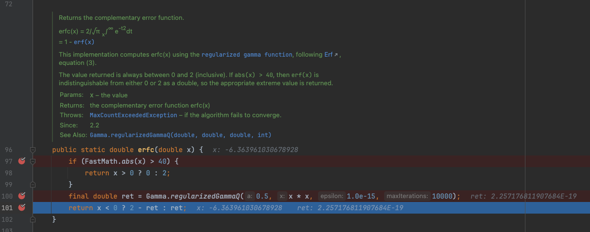

Floating-point Arithmetic
====

When `org.apache.commons.math3.distribution.NormalDistribution` is used as below,

```
@Test
void testStatisticUtil() {
    final NormalDistribution normalDistribution = new NormalDistribution(0.0, 1.0);
    final double input = 9.0;
    assertEquals(1, normalDistribution.cumulativeProbability(input));
}
```

the assertion will succeed. We know that mathematically only when input is positive infinite, will the cumulative probability be `1`, but why here when `9.0`, which is far from positive infinite, is entered, `1` is returned? 

The root cause is the floating number issue.



In Java, the double data type is a 64-bit floating-point number, which means it can represent a very wide range of values, from around `4.9e-324` to `1.8e+308`. However, this wide range comes with a trade-off in precision. The double data type can only represent a finite set of decimal values exactly, and some decimal values, like `0.1`, cannot be represented exactly.

When the value of a double is as small as `1E-19`, it is at the very limits of the precision that the double data type can represent. Due to rounding errors and the way floating-point arithmetic works, the actual value stored in the double variable may be slightly different from the value you expect.

For example, consider the following code:
```
double x = 1E-19;
System.out.println(1 - x); // Output: 1.0
```
Even though the value of x is `1E-19`, when you subtract it from `1.0`, the result is still `1.0`. This is because the difference between `1.0` and `1E-19` is so small that it falls within the rounding error of the double data type.

## Formula

The conversion between the 64-bit floating-point number in decimal and binary number is 

$$
x_{(10)} = sign \times (1 + \frac{M_{(2)}}{2^{52}}) \times 2^{(E-(2^{10}-1))}
$$

where,
- Sign Bit (1 bit): `0` for positive and `1` for negative
- Exponent Bits (11 bits): The value of the exponent field is the actual exponent plus a bias of `1023`
- Mantissa Bits (52 bits): The mantissa represents the fractional part of the number, with an implied leading `1`

## Example

Given `1E0`, in binary it's represented as

`0 01111111111 0000000000000000000000000000000000000000000000000000`

Given `1E-19`, in binary it's represented as

`0 01110111111 1101100000111100100101001111101101101101001010101100`

- Sign Bit (1 bit): +
- Exponent Bits (11 bits): Here the value of exponent field is `011 1011 1111` (1004), the bias is `011 1111 1111` (2^10 - 1 = 1023), and the actual exponent is `-64`
- Mantissa Bits (52 bits): Here the value is `1101100000111100100101001111101101101101001010101100`.

Note that the mantissa component itself is limited to 52 bits, giving it the ability to precisely represent around 15-16 decimal digits in the fractional part of the number, according to [IEEE 754](https://standards.ieee.org/ieee/754/6210/). Try it yourself in [binary-system](https://binary-system.base-conversion.ro/convert-real-numbers-from-decimal-system-to-64bit-double-precision-IEEE754-binary-floating-point.php).

Then `1E0 - 1E-19` results in

`0 01111111111 0000000000000000000000000000000000000000000000000000` because Mantissa (52 bits) of `1E-19` shifted 64 bits to the right will result in `0`.

## Reference

- [Online Binary-Decimal Converter](https://www.binaryconvert.com/)
- [Regularized Gamma Function](https://mathworld.wolfram.com/RegularizedGammaFunction.html)
- [Erf](https://mathworld.wolfram.com/Erf.html)
- [没有显卡的年代，这群程序员用4行代码优化游戏](https://youtu.be/g1r3iLejTw0?si=e0L12DXOtCKwrnjT)
- [JAVA Floating Point Number’s Rounding Problem & Solution](https://arshadsuraj.medium.com/java-floating-point-numbers-rounding-problem-solution-a07e019b9dd5)